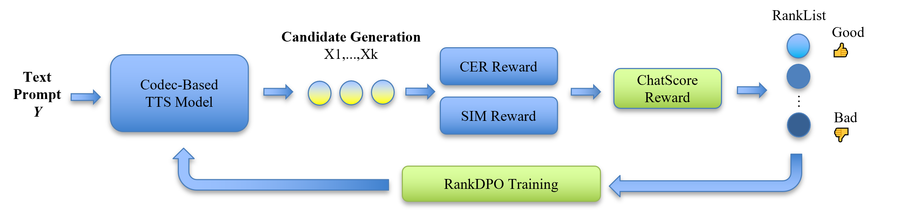
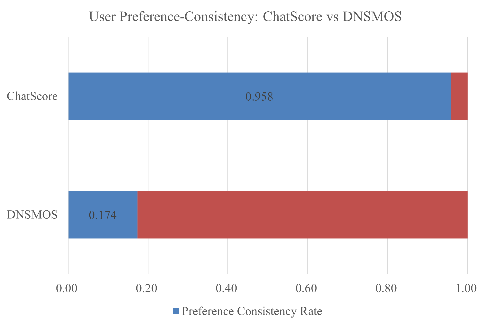

# Style-Aware RankDPO
Official implementation of the paper  
**“Style-Aware RankDPO for Stable Speech Synthesis” (ICASSP 2026, under review)** 

[Demos](https://fun-audio-llm.github.io); [Paper](https://funaudiollm.github.io/pdf/CosyVoice_v1.pdf); [Modelscope](https://www.modelscope.cn/studios/iic/CosyVoice-300M), 

these framework is used for post-SFT fine-tuning and implemented upon:

**CosyVoice 2.0**: [Paper](https://arxiv.org/abs/2412.10117); [Modelscope](https://www.modelscope.cn/studios/iic/CosyVoice2-0.5B); [HuggingFace](https://huggingface.co/spaces/FunAudioLLM/CosyVoice2-0.5B)

## Overview

This repository provides the implementation of **RankDPO**, a listwise preference optimization method for speech alignment,  
and **ChatScorer**, a learned reward model designed to evaluate **style consistency** and **natural conversational behavior** in TTS systems.

<p align="center">
  
</p>

**Key ideas:**  
- RankDPO extends Direct Preference Optimization (DPO) to *listwise* training, allowing the model to leverage full ranking information across multiple candidate audios.  
- Meanwhile, ChatScorer predicts naturalness and conversational style while removing speaker bias via a GRL-based adversarial branch.

## Highlight🔥

-  **Listwise preference optimization (RankDPO)** — efficiently exploits ranking information from multiple samples per prompt.  
-  **ChatScorer reward model** — trained to measure *style stability* and *speaker-independent naturalness*.  
-  **Better style control** — reduces “machine-like” or unstable utterances in conversational TTS.  
-  **Modular training framework** — supports DPO, RankDPO, and DiffRO variants under a unified pipeline.  

## Install

### Clone and install

- Clone the repo
    ``` sh
    git clone --recursive https://github.com/Brian4Sang/RankDPO-TTS.git
    cd RankDPO-TTS
    git submodule update --init --recursive
    ```

- Install Conda: please see https://docs.conda.io/en/latest/miniconda.html
- Create Conda env:

    ``` sh
    conda create -n rankdpo -y python=3.10
    conda activate rankdpo
    # pynini is required by WeTextProcessing, use conda to install it as it can be executed on all platforms.
    conda install -y -c conda-forge pynini==2.1.5
    pip install -r requirements.txt -i https://mirrors.aliyun.com/pypi/simple/ --trusted-host=mirrors.aliyun.com
    
    # If you encounter sox compatibility issues
    # ubuntu
    sudo apt-get install sox libsox-dev
    # centos
    sudo yum install sox sox-devel
    ```

### Model download

We strongly recommend that you download pretrained `CosyVoice2-0.5B` model as well as our trained model on it and `CosyVoice-ttsfrd` resource.

``` python
# SDK模型下载
from modelscope import snapshot_download
snapshot_download('iic/CosyVoice2-0.5B', local_dir='pretrained_models/CosyVoice2-0.5B')
snapshot_download('iic/CosyVoice-ttsfrd', local_dir='pretrained_models/CosyVoice-ttsfrd')

pip install gdown
# Download our trained RankDPO checkpoint
gdown --id 1vJ8rrsYAJVnrMdqydK4fucl95v1QKAGW -O pretrained_models/RankDPO_ckpt.zip

# Unzip the checkpoint
unzip pretrained_models/RankDPO_ckpt.zip -d pretrained_models/
```

``` sh
# git模型下载，请确保已安装git lfs
mkdir -p pretrained_models
git clone https://www.modelscope.cn/iic/CosyVoice2-0.5B.git pretrained_models/CosyVoice2-0.5B
git clone https://www.modelscope.cn/iic/CosyVoice-ttsfrd.git pretrained_models/CosyVoice-ttsfrd
```


Optionally, you can unzip `ttsfrd` resource and install `ttsfrd` package for better text normalization performance.

Notice that this step is not necessary. If you do not install `ttsfrd` package, we will use WeTextProcessing by default.

``` sh
cd pretrained_models/CosyVoice-ttsfrd/
unzip resource.zip -d .
pip install ttsfrd_dependency-0.1-py3-none-any.whl
pip install ttsfrd-0.4.2-cp310-cp310-linux_x86_64.whl
```

### Basic Usage

### Basic Usage

#### 1. Inference (Multi-turn Dialogue)

Since our RankDPO model is fine-tuned on specific speaker embeddings (`tianqing` and `zhihao`), we recommend testing the model stability through a multi-turn dialogue generation script.

**Note:** The code below is already included in `testsft.py`. You can run it directly to generate the demo audio.

```python
import os
import time
import torch
import torchaudio
import sys

# Ensure third-party dependencies are in path if needed
sys.path.append('third_party/Matcha-TTS') 
from cosyvoice.cli.cosyvoice import CosyVoice2

# 1. Load the Fine-tuned Model
# [TODO: Change this path to your actual RankDPO checkpoint path]
model_dir = 'pretrained_models/RankDPO_v1' 

print(f"Loading RankDPO model from {model_dir}...")
# We use CosyVoice2 wrapper as our base
cosyvoice = CosyVoice2(
    model_dir, 
    load_jit=True, load_trt=True, load_vllm=False, fp16=True
)

# 2. Setup Output Directories
output_root = 'outputs/dialogue_demo'
spk_a = 'tianqing'  # Fine-tuned speaker A
spk_b = 'zhihao'    # Fine-tuned speaker B

dir_a = os.path.join(output_root, spk_a)
dir_b = os.path.join(output_root, spk_b)
dir_merged = os.path.join(output_root, "merged")
os.makedirs(dir_a, exist_ok=True)
os.makedirs(dir_b, exist_ok=True)
os.makedirs(dir_merged, exist_ok=True)

# 3. Define Dialogue Script
dialogue = [
    ("tianqing", "你有没有过这种感觉？去参加老同学的婚礼，音乐一响，新人走出来，心里除了祝福，还有种复杂的感受。"),
    ("zhihao", "我太懂了。看着台上的新人，脑子里却闪回过去的画面。昨天还在宿舍里打游戏，今天就西装革履站在台上了。"),
    ("tianqing", "对！婚礼不仅是新人新篇章的开始，也会让台下的我们感受到强烈的时间跨越。"),
    ("zhihao", "没错，这种仪式感很容易触动人，让我们去审视自己走过的路，把过去和现在一下子连接起来。"),
    # ... (Complete dialogue is in testsft.py)
]

# 4. Synthesis & Merge
sr = cosyvoice.sample_rate
gap_30ms = torch.zeros(1, int(0.03 * sr), dtype=torch.float32) # Silence gap
merged_pieces = []

print("Start inference...")
for idx, (spk, text) in enumerate(dialogue):
    # Use inference_instruct_spk for fine-tuned speakers
    for seg_id, seg in enumerate(cosyvoice.inference_instruct_spk(text, spk, stream=False)):
        wav = seg['tts_speech']
        
        # Save individual segments
        if spk == spk_a:
            out_path = os.path.join(dir_a, f"{idx:02d}_{spk}_{seg_id}.wav")
        else:
            out_path = os.path.join(dir_b, f"{idx:02d}_{spk}_{seg_id}.wav")
        torchaudio.save(out_path, wav, sr)
        
        merged_pieces.append(wav)

    # Add silence between turns
    if idx != len(dialogue) - 1:
        merged_pieces.append(gap_30ms)

# 5. Save Final Merged Audio
merged_wav = torch.cat(merged_pieces, dim=1)
ts = time.strftime("%Y%m%d_%H%M%S")
merged_path = os.path.join(dir_merged, f"dialogue_rankdpo_{ts}.wav")
torchaudio.save(merged_path, merged_wav, sr)

print(f"Merged audio saved to: {merged_path}")
```
## Results

to  be continued ...



## Evaluation Metrics

### Pass@K (Capability Upper Bound)
**Pass@K** evaluates whether the model retains *any* valid solution path within its stochastic generation space.  

This metric reflects the **upper-bound potential** of the model by checking the *existence* of at least one correct response.  
A reduction in Pass@K indicates **mode collapse**, meaning that low-probability but high-quality solution modes have disappeared from the model's output space.

---

### Failure@K (Stability Lower Bound)
**Failure@K** measures the model's *worst-case reliability* by requiring all \( K \) generations to be correct.  


This metric captures the **lower-bound performance** of the model, reflecting its **single-shot stability** and consistency under repeated generation.

---

- **Pass@K** assesses whether the model *can* succeed (capability upper bound).  
- **Failure@K** assesses whether the model *always* succeeds (stability lower bound).


## Acknowledge

1. We borrowed a lot of code from [Cosyvoice].

## Disclaimer
The content provided above is for academic purposes only and is intended to demonstrate technical capabilities. Some examples are sourced from the internet. If any content infringes on your rights, please contact us to request its removal.
